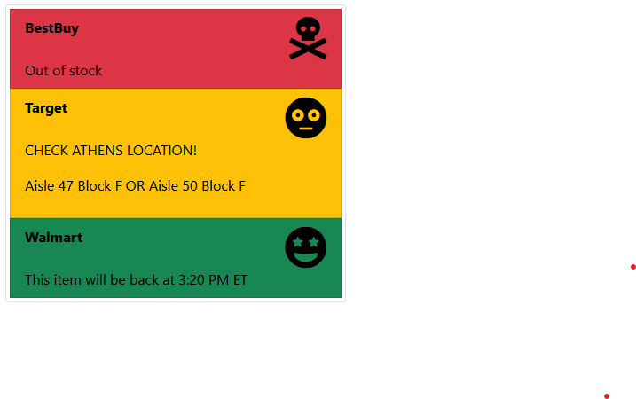

# PS5 Availability Tracker

Real time updates scraped directly from the website to help you fail at actually being able to add it to your cart and checkout.  Make frustration more frantic and hopefully beat out a scalper or two.

# Features

## Backend: Python REST Server with FastAPI

* Official APIs used whenever possible, JS avoidance tactics with browser automation completely avoided
* Each store response customized to account for all situations (such as target giving local availability or Walmart giving exact dates/times of their next restock/refresh)
* Simple but performant webserver is easily modifiable sends mostly filtered JSON data to the front end, taking the load off your browser
* Specific webscrapers inherit from the simple parent Checker class, allowing customization for the next hot product (GPU's anyone?)

## Frontend: Vue.js SPA with Axios and Bootstrap

* Easy to understand and easy to extend



## Project setup
```
npm install
```

### Compiles and hot-reloads for development from inside `ps5-dashboard`
```
npm run serve 
```

### Starts the Python webserver from inside `server`
```
uvicorn server:app --reload
```

### Start both servers at once.

I don't really recommend this unless you just plan on closing your terminal right after.
Replace zsh with what is appropriate for your system.

```
zsh -c "cd server && uvicorn server:app --reload; cd ps5_dashboard && npm run serve" & > output.txt &
```

### Compiles and minifies for production
```
npm run build
```

### Lints and fixes files
```
npm run lint
```

### Customize configuration
See [Configuration Reference](https://cli.vuejs.org/config/).
